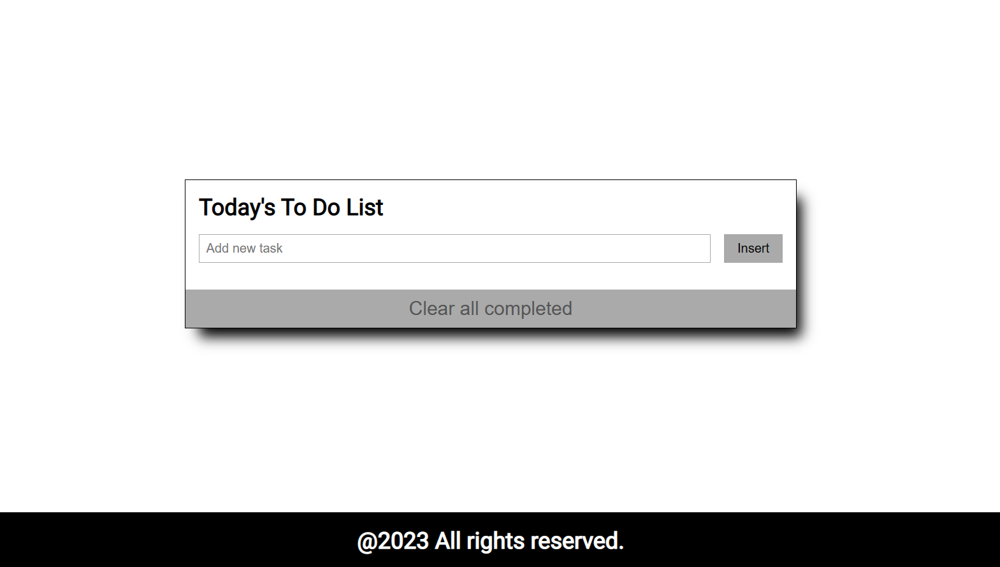

# To-do List project

  <h3><b>To-do List project setup</b></h3>

# 📗Table of Contents

- [📖 About the Project](#about-project)
- [🛠 Built With](#built-with)
- [Tech Stack](#tech-stack)
- [Key Features](#key-features)
- [💻 Getting Started](#getting-started)
  - [Prerequisites](#prerequisites)
  - [Setup](#setup)
  - [Usage](#usage)
  - [Preview](#preview)
- [👥 Authors](#authors)
- [🔮 Future Features](#future-features)
- [🤝 Contributing](#contributing)
- [🙏 Acknowledgements](#acknowledgements)
- [📝 License](#license)

<!-- PROJECT DESCRIPTION -->

# 📖 To-do List project setup 

In this project, I have build a To Do tasks web-application. This simple web page will be built using webpack and served by a webpack dev server. Also implemented the CRUD (create, read, update, delete) methods. All the elements of the user interface are fully functional and completed. Add some functionality to the application to make it interactive. The user will also be able to mark task completion by selecting the corresponding checkbox (or undo it by unchecking the checkbox). The updated tasks list will be stored in local storage.

## 🛠 Built With 

### Tech Stack 

  
Client

  <ul>
    <li>HTML</li>
    <li>CSS</li>
    <li>JS</li>
    <li>.md</li>
    <li>Webpack</li>
  </ul>

<!-- Features -->

### Key Features 

- **Used webpack to bundle Javascript**
- **ES6 syntax**
- **Linters**

(<a href="#readme-top">back to top</a>)

## 💻 Getting Started 

### Prerequisites

In order to run this project you need:

A Browser

### Setup

Clone this repository to your desired folder:

[`dhirajsingha143/To-do_list`](https://github.com/dhirajsingha143/To-do_list.git)

### Install

Install this project with:
A commandline interface e.g Gitbash

### Usage

To run the project, execute the following command:
**Click on the live server button on your IDE**

(<a href="#readme-top">back to top</a>)

<!-- PREVIEW -->

### Preview

 

- [Visit here](#) for demo verson. (**Live link will be avalable after completion of the project**)

<!-- AUTHORS -->

## 👥 Authors 

👤 **Dhiraj Singha**

- GitHub: [@githubhandle](https://github.com/dhirajsingha143)
- Twitter: [@twitterhandle](https://twitter.com/DhirajS89134)
- LinkedIn: [LinkedIn](https://www.linkedin.com/in/dhiraj-singha-b6871717a/)

(<a href="#readme-top">back to top</a>)

<!-- FUTURE FEATURES -->

### 🔮 Future Features 

- More better UI.
- Clear all button will be functional.

(<a href="#readme-top">back to top</a>)

<!-- CONTRIBUTING -->

## 🤝 Contributing 

Contributions, issues, and feature requests are welcome!

Feel free to check the [issues page](../../issues/).

(<a href="#readme-top">back to top</a>)

<!-- ACKNOWLEDGMENTS -->

## 🙏 Acknowledgments 

🙏 Acknowledgments

I appreciate Microverse for providing the learning resources for this exercise, for helping me out when I ran into problems.

(<a href="#readme-top">back to top</a>)

<!-- LICENSE -->

## 📝 License 

This project is [MIT](/MIT.md) licensed.

(<a href="#readme-top">back to top</a>)
